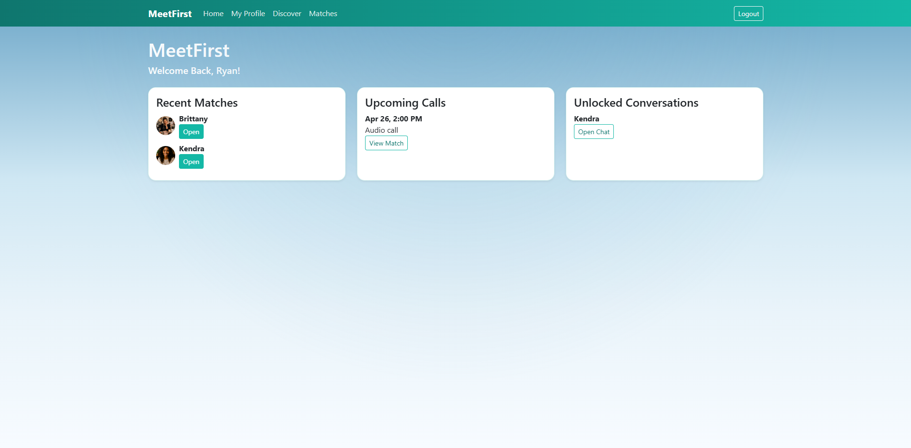
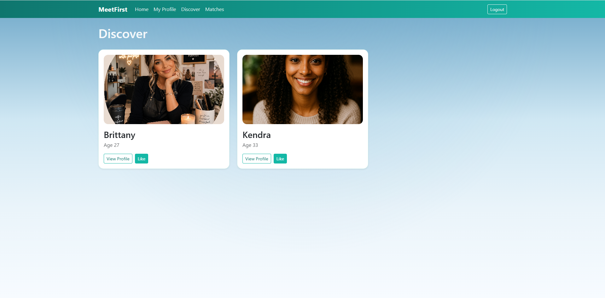
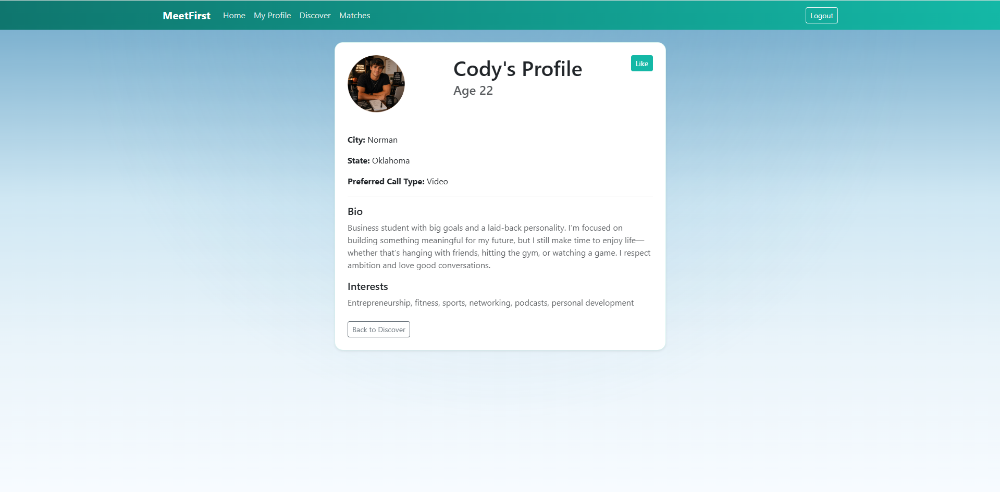
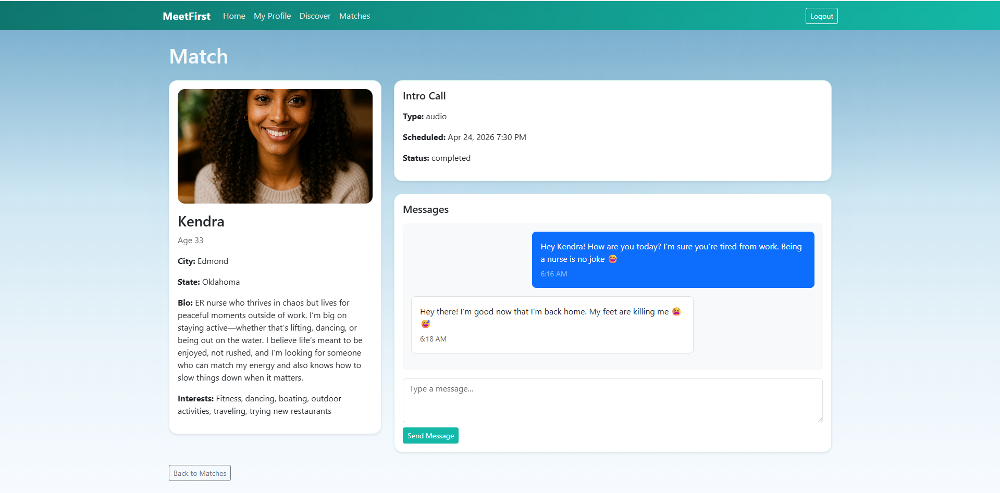
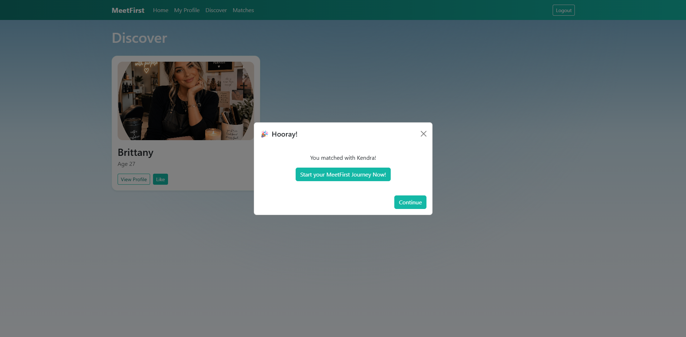

# MeetFirst

MeetFirst is a full-stack Django web application that reimagines modern dating by encouraging real connection first — through scheduled intro calls before messaging is unlocked.

## Features

- User authentication (signup, login, logout)
- Custom user profiles with:
  - Profile picture uploads
  - Bio, interests, location, and preferences
- Like system with mutual match detection
- Automatic match creation on mutual likes
- Intro call scheduling system
- Cancel call with confirmation flow
- Messaging unlocks after interaction flow
- Dynamic modal notifications for matches
- Modern UI with custom styling and gradient theme

---

## Key Concepts Demonstrated

- Django Models, Views, Templates (MVT)
- User authentication and relationships
- File uploads & media handling (`MEDIA_URL`, `MEDIA_ROOT`)
- Profile images are not included in this repository. To test image uploads locally:
    - Upload images through the app after running the server
- Conditional rendering in templates
- Form handling and CSRF protection
- Bootstrap UI customization
- JavaScript interactivity (modals, confirmations)
- Clean UI/UX design patterns

---

## Screenshots

### Dashboard


### Discover Profiles


### Profile Page


### Match Detail + Call Scheduling


### Match Notification Modal


---

## Tech Stack

- **Backend:** Django, Python
- **Frontend:** HTML, CSS, Bootstrap
- **Database:** SQLite (development)
- **Media Storage:** Local file storage (profile images)

---

## Setup Instructions

```bash
git clone https://github.com/ryancoderjackson/meetfirst.git
cd meetfirst

python -m venv venv
venv\Scripts\activate   # Windows

pip install -r requirements.txt

python manage.py migrate
python manage.py runserver